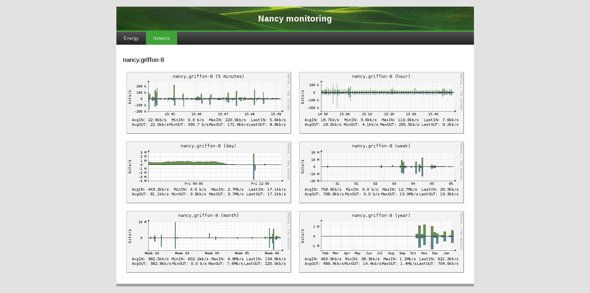

..
      Copyright 2013 François Rossigneux (Inria)

      Licensed under the Apache License, Version 2.0 (the "License"); you may
      not use this file except in compliance with the License. You may obtain
      a copy of the License at

          http://www.apache.org/licenses/LICENSE-2.0

      Unless required by applicable law or agreed to in writing, software
      distributed under the License is distributed on an "AS IS" BASIS, WITHOUT
      WARRANTIES OR CONDITIONS OF ANY KIND, either express or implied. See the
      License for the specific language governing permissions and limitations
      under the License.

.. _architecture:

===================
System Architecture
===================

Overview of the global layered architecture:

.. image:: ./layered_architecture.png

Kwapi drivers
=============

Kwapi drivers are derived from a Driver superclass, itself derived from Thread.
So drivers are threads. At least one driver thread is instantiated for each wattmeter
or switch you want to monitor. Their constructors takes as arguments a list of 
probe IDs, and kwargs (specific arguments).

Driver threads roles are:

#. Setting up a wattmeter or a switch.
#. Listening and decoding received data.
#. Calling a driver superclass method with measurements as argument.
   This method appends signature to the measurements, and publishes them on the bus.

Message format:

.. image:: ./message_format.png
    :width: 675px

There is several types of drivers already implemented in Kwapi. You can of course 
implement your own driver.

SNMP drivers
------------

Using the SNMP protocol and the right OIDs, you can retrieve a subtree of values 
corresponding, for a wattmeter, at the power consumption, for a switch, at the 
network traffic of ihis interfaces.

Of course, this driver works with any device that implement SNMP protocol. So 
you can retrieve other metrics depending on what you want to monitor.

Wattmeters via SNMP
^^^^^^^^^^^^^^^^^^^
Kwapi supports different kinds of wattmeters (IPMI, Eaton PDU, Wattsup, etc).
Wattmeters communicate via IP networks or serial links. Each wattmeter has one
or more sensors (probes). Wattmeters send their values quite often (each
second), and they are listen by wattmeter drivers.

Network drivers
^^^^^^^^^^^^^^^
Second type of drivers is the network drivers. Giving a switch address and the 
correct protocol, you can retrieve incoming and outgoing traffic. You have just to
configure the right OIDs and allow SNMP requests on the switch. Every port of the given
switch is scanned and the current counter value of the interface is assigned to the 
configured neighbor. This counter is a 64-bits number that correspond to the total 
number of octets received on the interface, including framing characters.

Dummy drivers
-------------
Added as a testing feature, dummy drivers just send the value you ask them to send.
They are used to simulate a probe. You can configure them as you wish. Kwapi implements
dummynet and dummywatt drivers to simulate network and wattmeter drivers.

IPMI drivers
------------
IPMI drivers use the command line `ipmitool` to retrieve information from IPMI sensors.

JSON url drivers
----------------
This driver can be used to get informations directly from JSON structured text 
of Grid'5000 API. It can be usefull when you want to import in Kwapi remote 
metrics from the Metrologie API.

Driver manager
--------------

The driver manager is the loader and the checker of driver threads. It loads
all drivers according the configuration file, and checks regularly that driver
threads are alive. In case of crash, the event is logged and the driver thread
is reloaded. We can imagine that a driver will crash if a technician unplug a
wattmeter, for example.

Bus
---

Currently, the internal Kwapi bus is ZeroMQ. Publishers are driver threads, and
subscribers are plugins.

Kwapi plugins
=============

Kwapi API plugin
----------------

Kwapi API offers a REST API. This API is linked in Grid'5000 API and adopts its
standard to expose live measures to the users. Such data can then be imported in
experiments by just sending a request to the API. This plugin contains a collector
that computes kWh for power, interface counters for network and an API based on Flask.

Collector
^^^^^^^^^

The collector stores these values for each probe:

.. image:: ./collector.png
    :width: 675px

Fields:
  * Probe id: could be the hostname of the monitored machine. But it is a bit
    more complicated because a probe can monitor several machines (PDU).
  * Timestamp: is updated when a new value is received.
  * Integrated (power only): is computed by taking into account the new value in watt, 
    and the elapsed time since the previous update.
  * Value: offers the possibility to know instantaneous consumption or traffic of a
    device, without having to query two times a probe in a small interval to
    deduce it. This could be especially useful if a probe has a large refresh
    interval: there is no need to wait its next value.
  * Unit: metric unit. For example 'W' stands for *watt* in power API.
  * Type: metric type can be 'Gauge' or 'Cumulative'. It indicates if measures
    are retrivied as counter or not and if an integrated value can be calculated

No history is kept by this plugin. Storage is offered with other plugins. The collector 
is cleaned periodically to prevent a deleted probe from being stored indefinitely
in the collector. So when a probe has not been updated for a long time, it is deleted.

API
^^^

====    ===========================     =====================================   ================================================
Verb    URL	                            Parameters	                            Expected result
====    ===========================     =====================================   ================================================
GET     /probe-ids/                                                             Returns all known probe IDs.
GET 	/probes/                                                                Returns all information about all known probes.
GET     /probes/<probe>/                probe id                                Returns all information about this probe
                                                                                (id, timestamp, value, type, integrated).
GET     /probes/<probe>/<metric>/       probe id                                Returns the probe's metric value.
                                        metric {power, network}
====    ===========================     =====================================   ================================================

Kwapi RRD plugin
----------------
It stores information from the drivers directly in RRD files. The advantage of such files is that they permits to render efficiently Graphs with various scales.
The size of the databases are constant. One database per probe and per metric is created. By default, RRD files are stored in `/var/lib/kwapi/kwapi-rrd`.

This plugin create and update automatically the RRD files, depending on the values he receives from the drivers.

As each plugin, he needs:
  * Probe id: probe identifier (could be different than probe name)
  * Name: metric name
  * Timestamp: time of the measure, given by the driver, unix format timestamp
  * Measure: measure
  * Parameters: other informations about the metrics

Kwapi Live plugin
-----------------

Web interface
^^^^^^^^^^^^^

The visualization plugin provides a web interface with power consumption and network traffic graphs. It is based on Flask and RRDtool.

====    =====================================   =========================================================   ==========================================
Verb    URL	                                    Parameters	                                                Expected result
====    =====================================   =========================================================   ==========================================
GET     /<metric>/last/<period>/                metric { power, network }                                   Returns a webpage with a summary graph
                                                period { minute, hour, day, week, month, year }             and all probe graphs.
GET     /<metric>/probe/<probe>/                metric { power, network }                                   Returns a webpage with all graphs about
                                                probe id                                                    this probe (all periods).
GET     /<metric>/summary-graph/<start>/<end>   metric { power, network }                                   Return a summary graph of the metric
                                                start timestamp                                             evolution about this period
                                                end timestamp
GET     /<metric>/graph/<probe>/<start>/<end>   metric { power, network }                                   Returns a graph about this probe.
                                                probe id
                                                start timestamp
                                                end timestamp
====    =====================================   =========================================================   ==========================================

Webpage with a summary graph and all probe graphs:

.. image:: ./webpage.png
    :width: 675px

Webpage with scales summaries of a probe:

In the menu bar, you can choose the period the metric you want to display.
For each metric you can select a timescale (last minutes, hour, day, week,
month or year). By clicking on a probe, you can display all graphs available
for this probe, with different resolutions.

You can select several probes and display a stacked summary of their consumption.
Use the job field to automatically monitor probes corresponding to your job (select
the correct probes and adapt timescale)

Graphs
^^^^^^

The summary graph shows the total measurements for the selected metric (sum of all the probes).
Each colour corresponds to a probe.

The legend contains:
  * Minimum, maximum, average and last measures.
  * Integrated measure (energy consumed (kWh) or network traffic (Kb/s)).
  * Cost if any.

File sizes:
  * RRD file: 10 Ko.
  * Probe graph: 12 Ko.
  * Summary graph: 24 Ko.

A cache mechanism prevents graphs from being rebuilt uselessly.

Kwapi forwarder
===============

The forwarder aims at decreasing the network traffic: if multiple plugins
listen the same probe, the metric is sent once on the network, and the
forwarder duplicate it and sends a copy to each listeners. The forwarder can
also be installed on a gateway machine, in order to connect isolated networks.

The following diagram shows these two features:

.. image:: ./bus.png
    :width: 675px

Using the forwarder is optional, and the plugins can be configured to subscribe
directly to the drivers. Direct subscribing without using the forwarder is
recommanded if the drivers and the plugins are running on the same machine.

Kwapi HDF5
==========

Kwapi HDF5 is used to store fine grained metric with Kwapi. Each measure returned by the drivers are stored in an HDF5 file on the server.
The main advantages of this database are:
* Very large datasets: store several months of power consumption of numerous probes
* Fast access
* Hierarchical store: data can be groupped by site or cluster
* Parallel writing
* Compressed file for low storage cost
* Heterogeneous data support

You can configure the split period of your HDF5 files in the configuration file (1 file per month or less) depending on how much data you want to save.

Collector
---------

The HDF5 Collector is composed of one Writter by metric with their proper buffers and a single queue per metric where all the data from drivers are appended.
  * The update function put the new received value in the queue that correspond to his metric.
  * Each Collector iterate on his corresponding queue and for each new measure, writes an entry in his internal buffer
  * When a Collector buffer is full, it writes his values to the database on the disk depending on the current date
  * If the plugin is stopped, a **STOP** flag his added in all the queues
  * When the Collector receive a **STOP** flag, buffers are flushed on the disk and Collector exits

Writes on the database are made with a fixed `chunk_size` that can be set in the configuration file.

API
---

REST API permits to retrieve measures from those databases. Unlike RRD database, HDFStore store raw measures and datas are not alterated.
API is very similar to Kwapi-API

====    =====================================     =====================================   ===========================================================
Verb    URL	                                      Parameters	                          Expected result
====    =====================================     =====================================   ===========================================================
GET     /<metric>/                                metric { power, network }               Returns all known probe IDs for the metric.
POST 	/<metric>/timeseries/[job-id|probes]      metric { power, network }               Return all data for the selected probes and selected range.
                                                  job_id in Grid'5000                     Selection is made with job_id or probe name given.
                                                  probes: list of probes
====    =====================================     =====================================   ===========================================================

Kwapi Ganglia
=============

This plugin his pretty simple. You first have to run a Ganglia server somewhere. It have to accept data from the remote Kwapi server.
For this, edit the configuration file according to Ganglia Documentation. Check for the Ganglia **multicast address**. 

The single parameter of this plugin is the `ganglia_server` address. Edit this field in the configuration file to point your remote Ganglia server.
All data received from your drivers will be sended to the server. Actual configuration just send single power probes consumption to Ganglia.

============    ==========================    ======================================================================
Metric          Remote name                   Parameters
============    ==========================    ======================================================================
power           pdu2                          * units: Watts
                                              * type: uint16
                                              * value: int(metrics)
                                              * hostname: ip:hostname (ex: 192.168.1.1:griffon-54.nancy.grid5000.fr)
                                              * spoof: True
                                              
network_in      None
network_out     None
============    ==========================    ======================================================================

