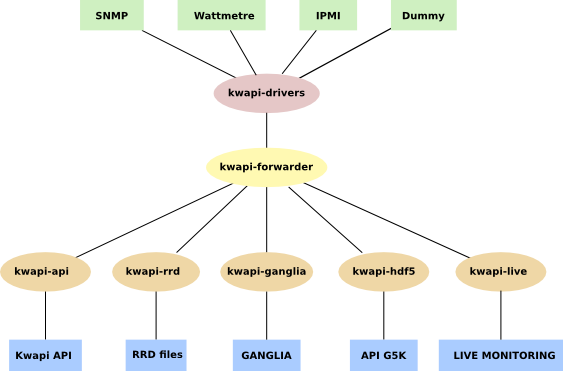
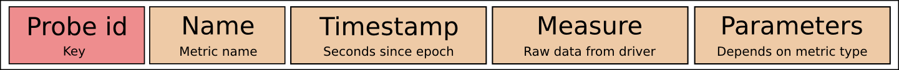
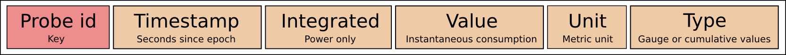
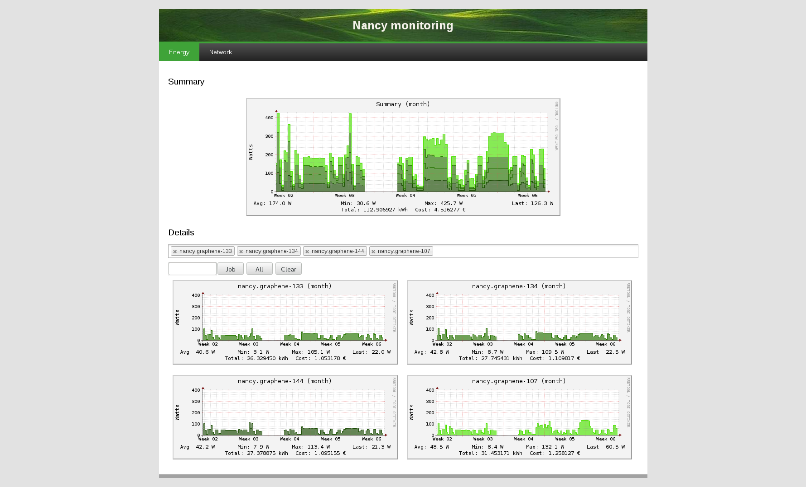

..
      Copyright 2013 François Rossigneux (Inria)

      Licensed under the Apache License, Version 2.0 (the "License"); you may
      not use this file except in compliance with the License. You may obtain
      a copy of the License at

          http://www.apache.org/licenses/LICENSE-2.0

      Unless required by applicable law or agreed to in writing, software
      distributed under the License is distributed on an "AS IS" BASIS, WITHOUT
      WARRANTIES OR CONDITIONS OF ANY KIND, either express or implied. See the
      License for the specific language governing permissions and limitations
      under the License.

.. _architecture:

===================
System Architecture
===================

Overview of the global layered architecture:

Kwapi drivers
=============

Kwapi supports different kinds of wattmeters (IPMI, Eaton PDU, Wattsup, etc).
Wattmeters communicate via IP networks or serial links. Each wattmeter has one
or more sensors (probes). Wattmeters send their values quite often (each
second), and they are listen by wattmeter drivers. Wattmeter drivers are
derived from a Driver superclass, itself derived from Thread. So drivers are
threads. At least one driver thread is instantiated for each wattmeter. Their
constructors takes as arguments a list of probe IDs, and kwargs (specific
arguments).

Driver threads roles are:

#. Setting up wattmeter.
#. Listening and decoding received data.
#. Calling a driver superclass method with measurements as argument.
   This method appends signature to the measurements, and publishes them on the bus.

Message format:

Driver manager
--------------

The driver manager is the loader and the checker of driver threads. It loads
all drivers according the configuration file, and checks regularly that driver
threads are alive. In case of crash, the event is logged and the driver thread
is reloaded. We can imagine that a driver will crash if a technician unplug a
wattmeter, for example.

Bus
---

Currently, the internal Kwapi bus is ZeroMQ. Publishers are driver threads, and
subscribers are plugins.

Kwapi plugins
=============

Kwapi API plugin
----------------

API plugin allows Ceilometer pollster to get consumption data through a REST
API. This plugin contains a collector that computes kWh, and an API based on
Flask.

Collector
^^^^^^^^^

The collector stores these values for each probe:

Fields:
  * Probe id: could be the hostname of the monitored machine. But it is a bit
    more complicated because a probe can monitor several machines (PDU).
  * Timestamp: is updated when a new value is received.
  * KWh: is computed by taking into account the new watt value, and the elapsed
    time since the previous update. It allows Ceilometer to compute average
    consumption for a given duration (knowing the kWh consumed and the time
    elapsed since its last check).
  * Watts: offers the possibility to know instantaneous consumption of a
    device, without having to query two times a probe in a small interval to
    deduce it. This could be especially useful if a probe has a large refresh
    interval: there is no need to wait its next value.

No history is kept because Ceilometer already has a storage architecture. The
collector is cleaned periodically to prevent a deleted probe from being stored
indefinitely in the collector. So when a probe has not been updated for a long
time, it is deleted.

API
^^^

====    ===========================     =====================================   ================================================
Verb    URL	                            Parameters	                            Expected result
====    ===========================     =====================================   ================================================
GET     /v1/                                                                    Returns detailed information about this specific
                                                                                version of the API.
GET     /v1/probe-ids/                                                          Returns all known probe IDs.
GET 	/v1/probes/                                                             Returns all information about all known probes.
GET     /v1/probes/<probe>/             probe id                                Returns all information about this probe
                                                                                (id, timestamp, kWh, W).
GET     /v1/probes/<probe>/<meter>/     probe id, meter { timestamp, kwh, w }   Returns the probe meter value.
====    ===========================     =====================================   ================================================

Authentication
^^^^^^^^^^^^^^

The pollster provides a token (X-Auth-Token). The API plugin checks the token
(Keystone request), and if the token is valid, requested data are sent.
Responses are not signed because Ceilometer trusts Kwapi plugin.

Ceilometer pollster
^^^^^^^^^^^^^^^^^^^

The API plugin is queried by a Ceilometer pollster. The Ceilometer pollster is
started periodically by Ceilometer central agent. It knows the Kwapi URL by
doing a Keystone request (endpoint-get). It queries probe values through Kwapi
API, using the GET /v1/probes/ call, so that it gets all detailed informations
about all probes in just one query. For each probe, it creates a counter object
and publishes it on the Ceilometer bus.

Published counters:
  * Energy (cumulative type): represents kWh.
  * Power (gauge type): represents watts.

Counter timestamps are Kwapi timestamps, so that Ceilometer doesn't store wrong
data if a probe is not updated. Ceilometer handles correctly the case where a
probe value is reset (kWh decrease), because of its cumulative type.

Kwapi RRD plugin
----------------

Web interface
^^^^^^^^^^^^^

The visualization plugin provides a web interface with power consumption graphs. It is based on Flask and RRDtool.

====    ===========================     =========================================================   ==========================================
Verb    URL	                            Parameters	                                                Expected result
====    ===========================     =========================================================   ==========================================
GET     /last/<period>/                 period { minute, hour, day, week, month, year }             Returns a webpage with a summary graph
                                                                                                    and all probe graphs.
GET     /probe/<probe>/                 probe id                                                    Returns a webpage with all graphs about
                                                                                                    this probe (all periods).
GET 	/graph/<period>/                period { minute, hour, day, week, month, year }             Returns a summary graph about this period.
GET     /graph/<period>/<probe>/        period { minute, hour, day, week, month, year }, probe id   Returns a graph about this probe.
====    ===========================     =========================================================   ==========================================

Webpage with a summary graph and all probe graphs:

In the menu bar, you can choose the period for which you want to display graphs
(last minutes, hour, day, week, month or year). By clicking on a probe, you can
display all graphs available for this probe, with different resolutions.

Graphs
^^^^^^

The summary graph shows the total power consumption (sum of all the probes).
Each colour corresponds to a probe.

The legend contains:
  * Minimum, maximum, average and last power consumption.
  * Energy consumed (kWh).
  * Cost.

File sizes:
  * RRD file: 10 Ko.
  * Probe graph: 12 Ko.
  * Summary graph: 24 Ko.

A cache mechanism prevents graphs from being rebuilt uselessly.

Kwapi forwarder
===============

The forwarder aims at decreasing the network traffic: if multiple plugins
listen the same probe, the metric is sent once on the network, and the
forwarder duplicate it and sends a copy to each listeners. The forwarder can
also be installed on a gateway machine, in order to connect isolated networks.

The following diagram shows these two features:

.. image:: ./bus.png
    :width: 675px

Using the forwarder is optional, and the plugins can be configured to subscribe
directly to the drivers. Direct subscribing without using the forwarder is
recommanded if the drivers and the plugins are running on the same machine.
